# birdsynth

A wavetable synthesizer for the browser, with the feature set of a modern
software wavetable synth (modelled on Serum 2) and an explainer layer that
shows how each stage works using live signals from the engine.

The DSP engine is written in Rust and compiled to WebAssembly (simd128), with
no imports. It runs inside an AudioWorklet. The UI is Svelte 5 + TypeScript.

**Play it:** https://birdsynth.abusing.technology


## What's in it

- **Oscillators:** three main oscillators, each one of five types:
  - wavetable: 256 frames, band-limited per octave
  - sample: loops, slices, tape-stop
  - multisample: SFZ
  - granular
  - spectral: resynthesis with time and pitch independent

  Each has unison up to 16 and two warp slots: sync, bend, PWM, FM, PD, AM and RM from other sources, distortion and remap. There are also a sub oscillator and a noise oscillator.

  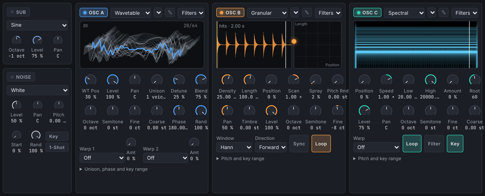

- **Filters:** two, in series or parallel, with 63 types on shared cores (SVF, ladders, diode, Sallen-Key, combs, phasers, formants, EQ shapes). Each source goes into Filter 1 or Filter 2, with a Split that sends a share to the other.

  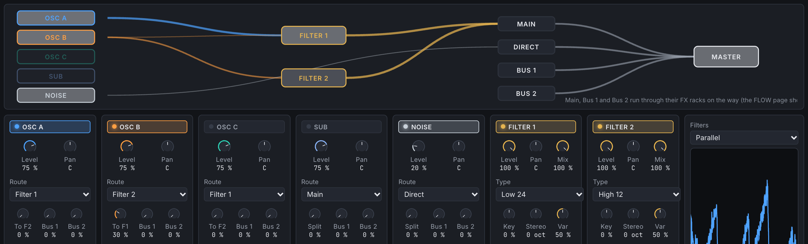

- **Modulation:** 4 envelopes, 10 LFOs (drawn, XY path, chaos, sample and hold), 8 macros, a 64-slot matrix with curves and aux sources, drag-to-modulate, Voice Control and MPE.

  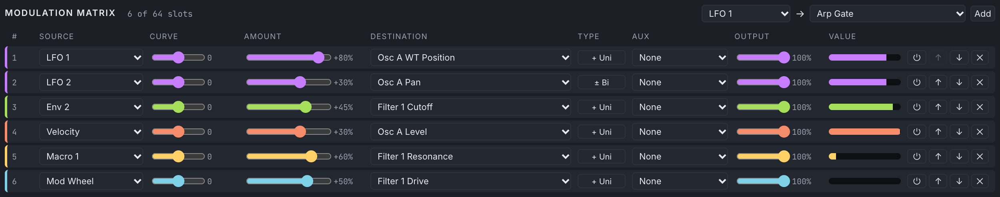

- **Effects:** three racks (Main, Bus 1, Bus 2) of hyper/dimension, distortion, flanger, phaser, chorus, delay, compressor (single and multiband), five reverbs, EQ, filter, frequency shifter, zero-latency convolution, utility and splitters.

  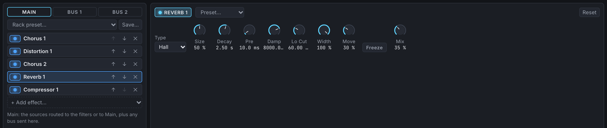

- **Sequencing:** an arpeggiator with step lanes, twelve clips with a piano roll, automation and recording, and MIDI file import and export. Also transport (the space bar plays and stops), swing and MIDI clock-in.

  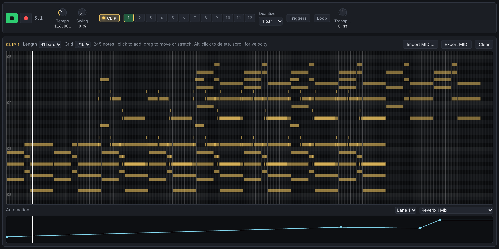

- **Link:** several birdsynths in step: your other tabs and, with Network on, other computers on the same network (or anywhere, given the same group code). One transport, tempo and bar position for all of them; any of them can start or stop the rest. See [docs/sync.md](docs/sync.md).

  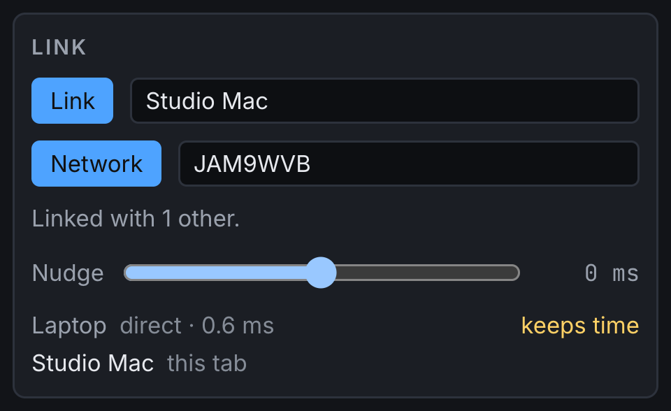

- **Wavetable editor:** draw tools, harmonics, a formula language, process and morph functions, and import from audio.

  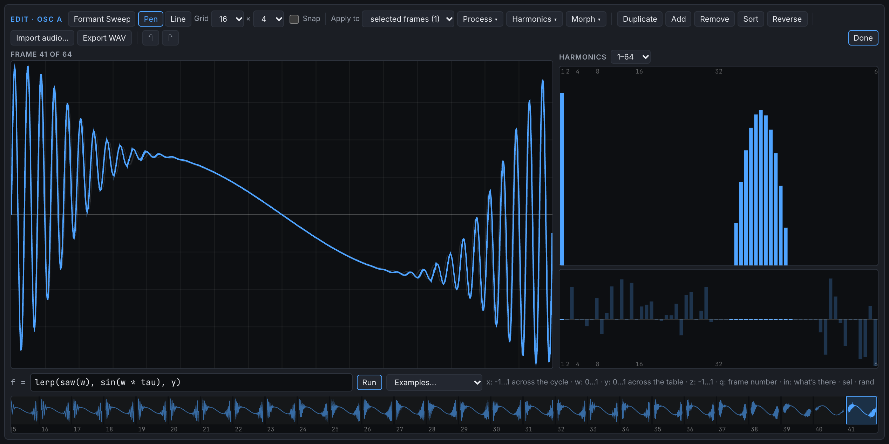

- **Presets:** a library in IndexedDB with tags, ratings and search, 31 factory presets, previews and Hybridize.

  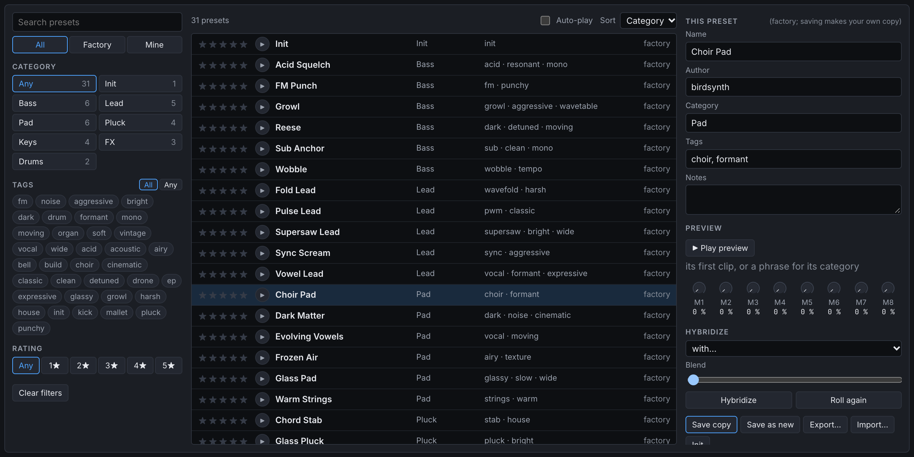

- **Other:** your sound is kept between visits (Reset is on the GLOBAL page), MIDI and MIDI learn, microtuning (.scl/.kbm/.tun), undo, and a CPU guard.

  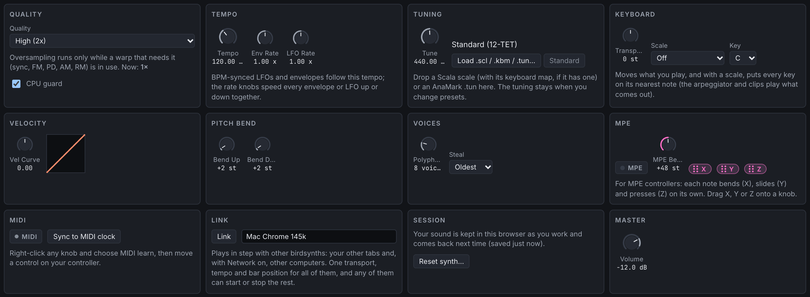

- **Explainer:** explain mode (click anything), six guided tours, and a FLOW page that shows the whole signal path as live scopes.

  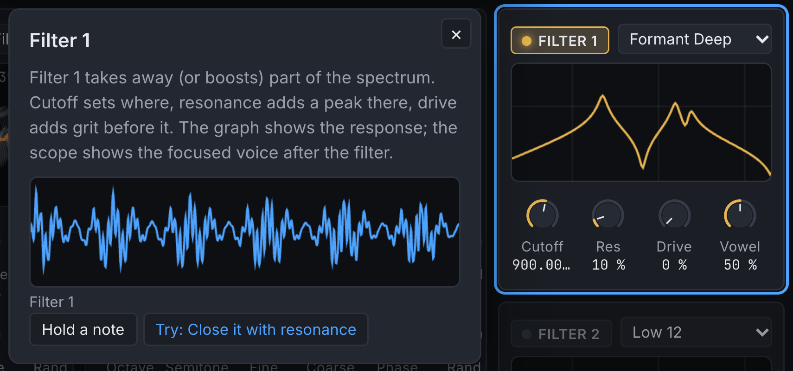

  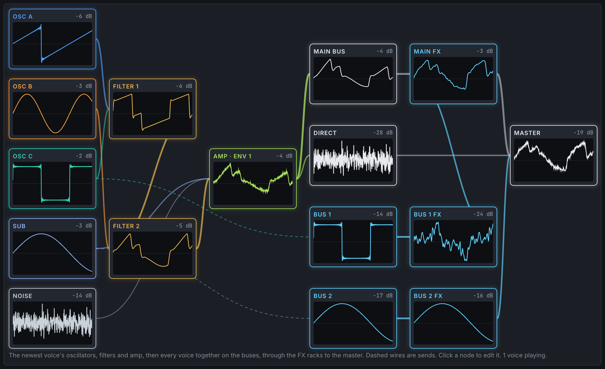

[docs/plan.md](docs/plan.md) has the design, each phase's numeric acceptance gates and the measurements that met them.

## Requirements

- Node 24 or newer (26 is tested)
- Rust through **rustup**, which reads `rust-toolchain.toml` and installs the
  pinned toolchain with the `wasm32-unknown-unknown` target. Homebrew's `rust`
  can't build for wasm.
- `wasm-opt` from binaryen (`brew install binaryen`). It's optional, but release
  builds use it.
- Docker with buildx, for deploying.

## Commands

| Command | What it does |
|---|---|
| `npm run dev` | Vite dev server on :5173. It rebuilds `engine.wasm` whenever Rust or the spec changes, then reloads. |
| `npm test` | Builds the wasm, then runs `cargo test` and vitest (engine in Node, worklet in `node:vm`, protocol, params, patches, tours' data). |
| `npm run build` | Production build into `dist/`. |
| `npm run preview` | Serves `dist/` on :4173. |
| `npm run gen` | Regenerates the codecs from `params/` and `schema/`. |
| `npm run check` | svelte-check type checking. |
| `deploy/deploy.sh` | Builds the site and runs it as a container on the host named in the script (port 8001). |
| `node tools/screenshots.mjs` | Retakes this README's screenshots in headless Chrome (`--url http://localhost:4173` for a local build; name shots to retake only those). |

## Playing

Keys `A`–`'` are white notes and `W E T Y U O P` are black notes. `Z`/`X` shift
the octave and `C`/`V` change the velocity. You can also click or drag on the
on-screen keyboard, or use a MIDI controller (Chrome, Edge and Firefox). The
`?` button turns on explain mode and lists the tours. `window.__synth` in the
console drives everything too, for example `__synth.noteOn(60)`,
`__synth.midiIn([0x90, 64, 100])` or `__synth.telemetry()`.

## Layout

```
params/**/*.toml       parameters: the single source of truth (ranges, curves, explainer text)
schema/protocol.toml   binary command layout, telemetry slots and taps
tools/gen-schema.mjs   generates crates/engine/src/spec/*.rs and web/src/gen/*.ts
crates/dsp             shared DSP: mip layout, warps, filters, oversampling, FFT, convolution layout
crates/engine          voices, oscillators, modulation, FX racks, sequencer, commands, taps and telemetry
crates/engine-wasm     the C ABI (engine.wasm: no imports, allocation-counting allocator)
crates/tools(-wasm)    mip building, previews, wavetable editor maths, recordings, analysis (a web worker)
web/src/audio          worklet processor, host, block pool, tap history, CPU guard
web/src/state          ParamBank and the stores: matrix, LFOs, FX, tables, patches, library, sequencer
web/src/ui             pages, panels, primitives, sequencer editors
web/src/explain        explain mode, tours and their checks, measurements
tests/                 vitest suites (the engine runs in Node from the real engine.wasm)
deploy/                Containerfile, nginx.conf, compose.yaml, deploy.sh
```

## How the pieces talk

The main thread writes binary command batches (see `schema/protocol.toml`). It
coalesces them per microtask and posts them to the worklet, which copies them
into the engine's command buffer in wasm memory. Every command carries an
absolute frame. Note-ons start on that exact frame; everything else lands on
the next 16-frame control boundary. Once per 1024 frames the worklet sends back
a pooled, transferable block holding the telemetry and the selected taps. Each
block is stamped with its frame, so scopes can draw what you're hearing right
now. If the engine traps, the worklet re-instantiates it within a quantum and
the host resends the parameters and the held notes.

## License

BSD 3-Clause; see [LICENSE](LICENSE). The wavetables, noises, impulse
responses and presets are generated by the code here. The bundled fonts, Inter
and JetBrains Mono, come from @fontsource under the SIL Open Font License 1.1.

birdsynth is an independent project and is not affiliated with or endorsed by
Xfer Records; Serum is their trademark, named here only to describe the
feature set.
